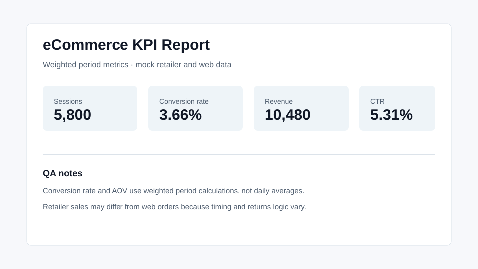

# eCommerce KPI Framework

KPI dictionary, sample data and calculation scripts for eCommerce analytics reporting.

This repo is built for analytics operations and dashboard governance. It documents metric definitions and shows how core eCommerce KPIs can be calculated from web, media and retailer-style data.

## Problem

Teams often use the same KPI names but calculate them differently. That creates stakeholder confusion, dashboard drift and repeated debates about which number is correct.

## What It Includes

- KPI dictionary for sessions, buy-now clicks, conversion rate, orders, revenue, average order value, repeat buyers and retailer sales.
- Mock web, media and retailer datasets.
- Python script that produces a monthly KPI report.
- Sample report for portfolio review.
- Tests for key formulas.

## Run the Sample

```bash
python scripts/build_kpi_report.py \
  --web data/web_sessions.csv \
  --retailer data/retailer_sales.csv \
  --media data/media_spend.csv \
  --out reports/sample_kpi_report.md
```

## Business Value

The framework gives teams a shared language before dashboards are built:

- metric name
- definition
- formula
- source fields
- grain
- caveats
- QA notes

That reduces ambiguity when business stakeholders, agencies, BI teams and developers need to align.

## Screenshots



## Why This Matters

Dashboard governance is easier when KPI logic is documented outside the dashboard itself. This repo shows how I think about making reporting definitions usable, testable and stakeholder-ready.

## What I Would Improve Next

- Add Looker Studio / BI wireframe examples.
- Add GA4 ecommerce event readiness checklist.
- Add retailer-specific mapping examples.
- Add dashboard sign-off template.

## License

MIT for code. KPI documentation may be reused with attribution.
